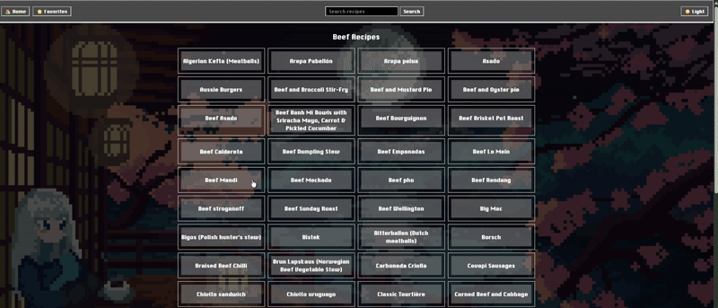

# Recipes Discovery App

## Description

A retro-styled recipe discovery SPA for browsing categories, viewing details, searching, and saving favorites. Built with Vite + React + TypeScript and React Router, featuring a playful background motif with light/dark themes and hover-rich UI elements.



## Table of Contents

- [Technologies Used](#technologiesused)
- [Features](#features)
- [Future Features](#nextsteps)
- [Deployed App](#deployment)
- [About the Authors](#author)

## <a name="technologiesused"></a>Technologies Used

- **TypeScript + React** - Component-driven UI with hooks and context
- **Vite** - Fast dev server and optimized production builds
- **React Router** - Client-side routing for SPA navigation
- **CSS3** - Retro-inspired styling with gradients, overlays, and hover states
- **gh-pages** - Static deployment to GitHub Pages

## <a name="features"></a> Features

**Recipe Browsing** - Navigate by category and open detailed recipe views  
**Search Experience** - Find recipes quickly via the search page  
**Favorites** - Save and manage favorite recipes with context state  
**Responsive Layout** - Optimized for desktop and mobile breakpoints  
**Theme Toggle** - Light/Dark aesthetic with animated backgrounds  
**Retro Styling** - Chicago-esque type, glassy cards, neon shadows  
**Zero-Backend Deploy** - Static SPA shipped via GitHub Pages

**In Progress:**

- [ ] More nuanced loading/empty states across views

## <a name="nextsteps"></a>Future Features

- **Pagination/Infinite Scroll** - Load more results per category/search
- **Advanced Filters** - Dietary tags, prep time, and ingredient filters
- **Ratings & Reviews** - Capture community feedback on recipes
- **Offline Ready** - Add a service worker for caching core assets
- **Global State Persistence** - Persist favorites to local storage by default
- **Share Links** - Social/shareable deep links per recipe
- **Accessibility Pass** - Improve focus states, landmarks, and ARIA labeling
- **Print-Friendly View** - One-click print/export for a recipe
- **Performance Tuning** - Image optimization and lighter background assets

## <a name="deployment"></a>Deployed Link

**Live Application:**  
[GitHub Pages](https://cfra8189.github.io/recipes-discovery-app/)

**Repository:**  
[GitHub Repository](https://github.com/cfra8189/recipes-discovery-app)

## <a name="author"></a>About The Authors

**THEE TEAM**

- **[Clarence Franklin](https://github.com/cfra8189)** - UI/UX, styling, deployment

## Development Process

This project was built collaboratively using:

- Git branching workflow for version control
- Feature-based commits with iterative styling passes
- Lightweight reviews and pair sessions for navigation and theming

## Installation & Setup

1. Clone the repository:

   ```bash
   git clone https://github.com/cfra8189/recipes-discovery-app.git
   ```

2. Navigate to project directory:

   ```bash
   cd recipes-discovery-app
   ```

3. Install dependencies:

   ```bash
   npm install
   ```

4. Start the dev server:

   ```bash
   npm run dev
   ```

5. Open in the browser at the host/port printed in the terminal (Vite default is `http://localhost:5173`).

6. To build for production:

   ```bash
   npm run build
   ```

7. To preview the production build locally:

   ```bash
   npm run preview
   ```

## Works Cited:

- [React Router Docs](https://reactrouter.com/)
- [Vite Documentation](https://vitejs.dev/)
- [MDN Web Docs - CSS](https://developer.mozilla.org/en-US/docs/Web/CSS)
- [Google Fonts - ChicagoFLF (inspired)](https://fonts.google.com/)
- Retro UI inspiration from classic Macintosh system aesthetics
